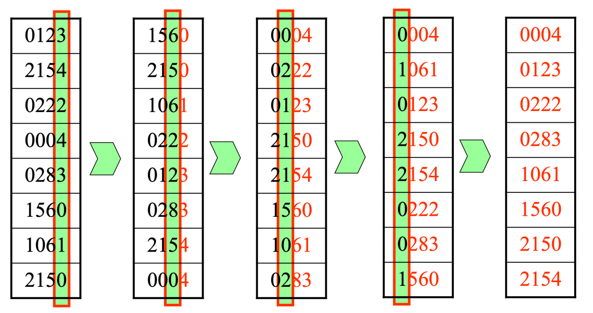

# Radix Sort

### 해당 코드의 전제 조건은 , k 자리 이하의 숫자들이 들어오는 경우에 적용가능한 , 특수 정렬이다. (O(n) 의 방법이다.)

## 정렬 결과만 추려낸 결과
- 입력
```
8
4
123 2154 222 4 283 1560 1061 2150
```

- 출력
```
[4, 123, 222, 283, 1061, 1560, 2150, 2154]
```


## 교재에서 나온 예제와 같이 출력한 결과

- 입력
```
8
4
123 2154 222 4 283 1560 1061 2150
```

- 출력
```
정렬을 진행하기 이전
[123, 2154, 222, 4, 283, 1560, 1061, 2150]

첫번째 자리 정렬을 진행한 후
[1560, 2150, 1061, 222, 123, 283, 2154, 4]

두번째 자리 정렬을 진행한 후
[4, 222, 123, 2150, 2154, 1560, 1061, 283]

세번째 자리 정렬을 진행한 후
[4, 1061, 123, 2150, 2154, 222, 283, 1560]

마지막 자리 정렬을 진행한 후
[4, 123, 222, 283, 1061, 1560, 2150, 2154]
```


